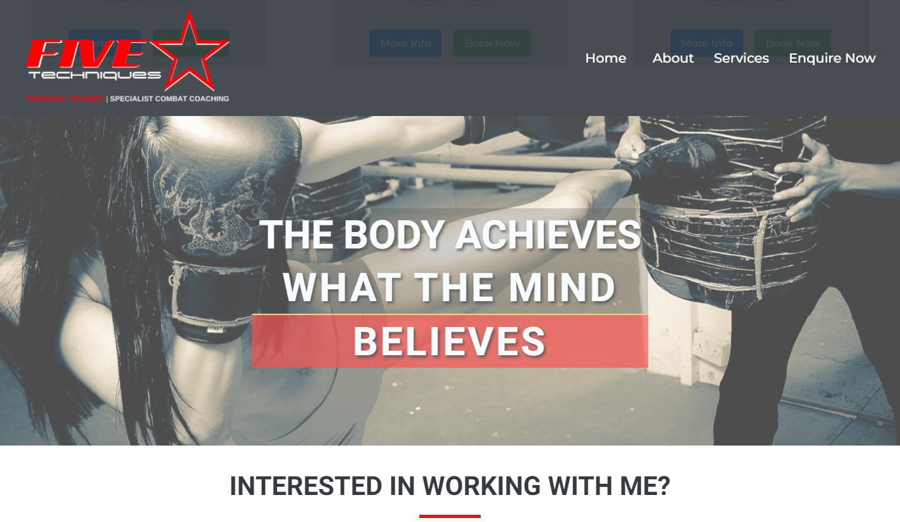

# [FiveStar Techniques](https://courtney-l.github.io/FiveStar-Tech/)
*Personal Training and Specialist Combat Coaching*

## Contents
* UX
    * Project Goals
    * User Goals
    * User Stories
    * Site Owner Goals
    * User Requirements and Expectations
    * Design Choices
        * Fonts
        * Icons
        * Colours
    * Features
        * Features that have been developed
        * Features that will be implemented in the future
    * Technologies Used
    * Testing
    * Bugs
    * Deployment
    * Credit

## UX (User Experience)

### Project Goals
The **goal** of this project is to highlight the trainer’s knowledge and expertise, display a range of pre-planned programs and offer a tailored service with the use of the contact form. This project is aimed towards fitness enthusiasts and individuals looking to improve their overall health and wellbeing in an appealing way.

### User Goals
  * **Find information** about the trainer’s experience
  * **Review** a variety of fitness programs
  * **Book a consultation** directly from the site
  * **Send** a **message** to the **site owner**
  * Easily **find contact information**
  * **Responsive site** accessible on Desktop, Tablet or Mobile

### User Stories
  * As a **user**, I need to feel comfortable with my potential trainer’s experience, personality and passion for fitness.
  * As a **user**, I want to find a suitable program for my needs where exercises are fun and engaging.
  * As a **user**, I want a trainer who can offer a varied and effective workout.
  * As a **user**, I need to locate a trainer who is accessible to my current location.

### Site Owner Goals
  * As a **site owner**, I want to generate new leads and interest from fitness enthusiasts.
  * As a **site owner**, I want to make the booking process self-explanatory.
  * As a **site owner**, I want to encourage feedback about services offered and how they can be improved.
  * As a **site owner**, I want to receive communication through the contact form.

### User Requirements and Expectations

**Requirements**
  * Browse the website using the navigation menu.
  * Locate information under titled sections
  * Visually appealing content with a mixture of text, images and subtle effects
  * Working contact forms with options

**Expectations**
  * Content is visually satisfying and informative.
  * Navigation and links work as intended.
  * Working buttons to avoid big lumps of clustered text.

### Design Choices
---
The influence of this project's theme came from a previous personal project, which contained sharp imagery that scaled well, so I decided to look for a colour scheme that would be complimentary.

**Fonts**

I selected fonts based on their readability and strength to effectively attract viewers. For the headers and titles I picked **Roboto** and **Montserrat** for general text.

**Icons**

Icons used where provided by [Font-Awesome](https://fontawesome.com/icons?d=gallery), used in moderation and are self-explanatory.

**Colours**

Used a previously designed logo as a starting point, the dominant **Red** was hard not to notice. Such a colour isn't just warm, but hot when used in design projects. The colour scheme I settled on would have **Red** as its primary colour.

The main colours used;
  * for **H2** Section Headers: **#343A40**;
  * for **H3** Section Sub-headers: **#C92222**;
  * for **H4**, **H5** Sub-titles and Cards: **#343A40**;
  * for the Header and Navigation Background: rgb**(52,58,64,0.9)**
  * for the Header and Navigation Text: **#F8F9FA**
  * for the Body and Section Backgrounds: White **#FFFFFF**;
  * for the Body Text: **#494949**;
  * for the Footer Background: **#343A40**;
  * for the Footer Text: **#F8F9FA**; Honey Yellow **#FFB100**

The parallax text colours used;
  * for some backgrounds: rgb **(52 58 64 / 0.25)**; 
  * for other backgrounds: rgb **(201 34 34 / 0.8)**;
  * for the horizontal rule: **#E3C44C**;
  * for text: **#F8F9FA**;

**Background**

Images used on the Parallax feature were from an 'old project', which I have permission to use. The imagery is crisp, sharp and is the inspiration behind my project choices.

## Wireframing

I used Balsamiq Wireframes to produce basic wireframes on various screen sizes. This helped me to arrange the overall layout and placement of elements on a single scrolling page, with anchored links and sections.

View my wireframes here:

* [Desktop Wireframe](wireframes/fst-desktop.png)
* [Tablet Wireframe - Portrait](wireframes/fst-tablet-portrait.png)
* [Tablet Wireframe - Landscape](wireframes/fst-tablet-landscape.png)
* [Mobile Wireframe - Portrait](wireframes/fst-mobile-portrait.png)
* [Mobile Wireframe - Landscape](wireframes/fst-mobile-landscape.png)

## Features

**Features** that have been **developed**:
* **Responsive** design on all screen sizes and viewports
* **Fixed Navigation**
* Scrolling **Parallax** effect
* Automatic **Slideshow**
* **Collapsible / Hidden** data
* Responsive **Modal**
* **Contact Forms** with required options
* Links to **Social Media**
* **Back to Top** scroll button

**Features** that will be **implemented** in the **future**:
* **Contact Forms** with form validation
* Transformation **Gallery**
* Testimonial **Slideshow**
* **Appointment / Booking** system
* Secure **Payment** options

## Technologies Used

**Languages**

* [HTML](https://en.wikipedia.org/wiki/HTML)
* [CSS](https://en.wikipedia.org/wiki/CSS)
* [JS](https://en.wikipedia.org/wiki/JavaScript)

**Tools & Libraries**

* [Git](https://git-scm.com/)
* [Bootstrap](https://getbootstrap.com/)
* [Font-Awesome](https://fontawesome.com/icons?d=gallery)
* [Google Fonts](https://fonts.google.com/)
* [Canva](https://www.canva.com/) used for royalty free images and graphic creation

## Testing

When testing this site I used an online tool called [Lambdatest](https://www.lambdatest.com/) and chromium dev tools.

I tested the CSS code with [CSS Validator](http://jigsaw.w3.org/css-validator/), which passed **without issue**.

The HTML code was tested with a [HTML Validator](https://validator.w3.org/) tool, which gave me the following **results:**

* Warnings:
    * The document is not mappable to XML 1.0 due to two consecutive hyphens in a comment
    * Attribute is unnecessary for JavaScript resources

* Errors:
    * Required form elements set without a multiple attribute or a size attribute
    * For attribute requires and id

* Fixes:
    * Shorten comment hypens
    * Removed type attribute
    * Removed for attribute
    
**Responsiveness**

* **Implementation**: I have  used **Bootstrap** throughout the project to ensure **maximum** responsibility. Tested with **devtools**.

* **Results**: **Responsiveness** was as expected, except for the **navbar**, which didn't collapse on click. I eventually found a simple working solution by reading **byllsa** [JavaScript](https://github.com/byIlsa/Aloy-from-outcast-to-heroine/blob/master/assets/js/scripts.js) file. Solution indirectly supplied by our **mentor**.

* **Verdict**: After **resolving** the navbar issue, everything was responsive therefore this test **passed**.

**Design**

* **Implementation**: The **design** of the site was influenced by the scrolling parallax effect, which looks sleek on single page sites. I used **colours** and **styles** which complimented the site logo and progressed from there.

* **Results**: The use of **fonts** and **colours** selected make the **content** standout throughout the site. I changed the opacity of the contact background image and introduced new colours to the list items as the text was hard to read.

* **Verdict**: The site looks as intended with everything working. This test has **passed**.

**Contact Form**

* **Implementation**: The **contact form** is used to contact the site owner. I modified the form example from the **Bootstrap** site for my own **needs**. Client side form validation was **implemented** at the same time, so **users** need to populate every form field, **before** being able to **Submit**.

* **Note**: It is not currently possible to submit the form, no feedback has been gathered yet.

* **Results**: The contact form is working as intended, form fields are validated.
* **Verdict**: Form validation works - test **passed**.

## Bugs

Here are some bugs I encountered **during development**;

* Fixed Navigation:
	* Added the no-gutters class to the header tag. This resolved the parallax overflow issue.

* Navigation Anchors:
    * Added a span inside each h2 section title, then set an id for the anchors.

* Navbar Links Not Collapsing After Click - **on mobile**:
    * Fixed this with some js.

* Parallax:
    * Set the correct z-index and set position to fixed.

* Slideshow JS:
	* The fade class for the slideshow clashed with the Modal fade class. Moved the slideshow js function to the end of functions.js script to resolve.

* Modal:
    * Placed the modal code outside of the main tag for the modal overlay to work correctly.

* Contact Background Image:
    * Changed the image opacity in Canva, then changed the contact & social list item colours to this pallette [Contact & Socials Palette](assets/img/fst-palette4.png)

## Deployment

## Credits

**Credit for text used on this website**

**Images Used**

**Special Thanks**

**Site for educational purposes only!**